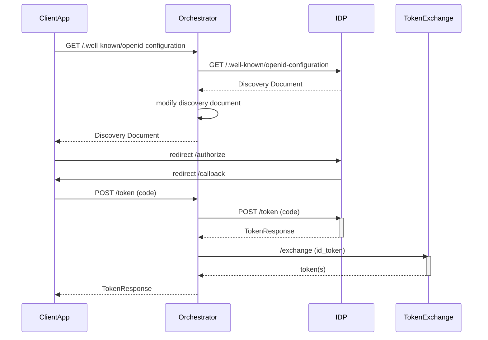

# OIDC Orchestrator

This is an oidc orchestrator that sits in front of a real IDP like azure EntraID (formerly AzureAD), OKTA, Auth0, etc.

Why in hell would I do this?  

When you buy someones app and they claim "We support SSO integration", DO NOT BELIEVE THEM.  Its usually such a simplistic integration that it basically useless.  

Mature client apps will let you do a [token exchange](https://oauth.net/2/token-exchange/) right after the SSO Login where the id_token is exchanged for an access_token that contains all the necessary claims for downstream api calls.  This is the way it should be done.   So, this orchestrator will take the id_token and exchange it for an access_token that contains all the necessary claims for downstream api calls.

In this example I am orchestrating google.  In the end the client app doesn't get google id_tokens or access_tokens.  Those are exchanged in the OAuth2 CODE flow for newly minted access_tokens that contain the necessary claims for downstream api calls.  If you have an internal OAuth2 service that supports token exchange, like I do, you would make a call to that by passing google id_token and get back a new access_token and optionally a refresh_token.

So if your apps SSO integration is pointing to AzureAD, and we all know that the access_tokens we get from Azure are useless.  We can then point the app to our orchestrator that will produce the right tokens.  

## OAuth2 Code Flow



## Swagger

[swag](https://github.com/swaggo/swag)  

```bash
cd cmd/server
swag init --dir .,../../internal
```

This will generate a docs.go file in the cmd/server folder.

## Downstream Services

[google](https://console.cloud.google.com/apis/credentials/oauthclient)  

## Launch Server

### Google Orchestrator

```powershell
cd cmd/server
go build .

$env:PORT = "9044";$env:DOWN_STREAM_AUTHORITY = "https://accounts.google.com"; .\server.exe
```

### Azure EntraID (Azure AD) Orchestrator

```powershell
cd cmd/clientapp
go build .

$env:PORT = "9044";$env:DOWN_STREAM_AUTHORITY = "https://login.microsoftonline.com/f3c3e0c3-ea9e-469c-aca8-3276a8b12d26/v2.0"; .\server.exe
```

## Launch Client App

### Google Client

```powershell
cd cmd/clientapp
go build .

$env:PORT = "5556";$env:OAUTH2_CLIENT_ID = "1096301616546-edbl612881t7rkpljp3qa3juminskulo.apps.googleusercontent.com";$env:OAUTH2_CLIENT_SECRET = "**REDACTED**";$env:AUTHORITY = "http://localhost:9044"; .\clientapp.exe
```

### Azure EntraID (Azure AD) Client

```powershell
cd cmd/clientapp
go build .

$env:PORT = "5556";$env:OAUTH2_CLIENT_ID = "fe794e91-40ef-430e-9aa5-29e3ca962928";$env:OAUTH2_CLIENT_SECRET = "**REDACTED**";$env:AUTHORITY = "http://localhost:9044"; .\clientapp.exe
```

